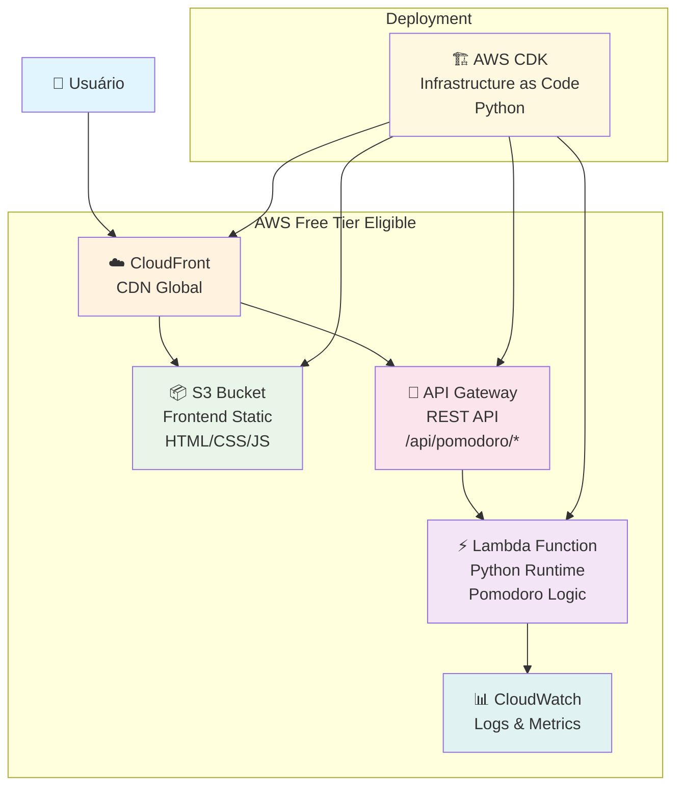

# 🍅 Pomodoro Timer

*Projeto desenvolvido para o Q Developer Quest TDC 2025*

Um timer Pomodoro simples e eficiente implementado em Python com arquitetura bem definida e testes automatizados.

## 📸 Screenshots


*Interface web responsiva com controles personalizáveis de tempo*

## Funcionalidades

- ⏰ Timer de trabalho (25 min padrão)
- ☕ Pausas curtas (5 min) e longas (15 min)
- 🔄 Gerenciamento automático de ciclos
- 📊 Contador de ciclos completados
- 🔔 Sistema de callbacks para notificações

## Arquitetura

O projeto segue uma arquitetura simples e modular:

- **PomodoroTimer**: Classe principal com lógica do timer
- **PomodoroState**: Enum para gerenciar estados
- **Callback System**: Para notificações de mudança de estado

Veja o [diagrama completo](architecture.md) para mais detalhes.

## Executar

### Frontend Web
```bash
# Abrir index.html no navegador
open index.html
# ou
python3 -m http.server 8000
# Acesse: http://localhost:8000
```

### Backend Python
```bash
# Executar o timer interativo
python3 main.py

# Executar todos os testes
python3 -m unittest test_pomodoro.py -v
```

### Deploy na AWS
```bash
# Deploy completo na AWS
./deploy.sh

# Ou manualmente:
cd infrastructure
pip install -r requirements.txt
cdk bootstrap
cdk deploy
```

## Testes

O projeto inclui três tipos de testes:

- **Unitários**: Testam componentes isolados
- **Integração**: Testam interação entre componentes  
- **E2E**: Testam fluxos completos do usuário

Todos os testes passam com 100% de sucesso.

## Infraestrutura AWS

O projeto inclui infraestrutura como código (IaC) usando AWS CDK:

- **Frontend**: S3 + CloudFront para distribuição global
- **Backend**: Lambda + API Gateway para API serverless
- **Configuração**: Amazon Q Developer integrado

### 🏗️ Diagrama da Arquitetura



**Fluxo de Dados:**
1. Usuário acessa via CloudFront (CDN global)
2. Frontend servido do S3 com cache otimizado
3. API calls roteadas via API Gateway para Lambda
4. Lambda executa lógica do Pomodoro em Python
5. CloudWatch coleta logs e métricas automaticamente

Veja [arquitetura detalhada](aws-architecture.md) para mais informações.

### 💰 Estimativa de Custos

| Serviço | Uso Estimado | Custo (Free Tier) | Custo (Pós Free Tier) |
|---------|--------------|-------------------|------------------------|
| **AWS Lambda** | 1.000 invocações/mês | $0.00 | $0.20/mês |
| **API Gateway** | 1.000 requests/mês | $0.00 | $3.50/mês |
| **Amazon S3** | <1GB, 100 requests/mês | $0.02/mês | $0.02/mês |
| **CloudFront** | 1GB transfer/mês | $0.00 | $0.08/mês |
| **TOTAL** | | **$0.02/mês** | **$3.80/mês** |

**Primeiro ano**: Praticamente gratuito com AWS Free Tier  
**Após free tier**: ~$3.80/mês para uso moderado

Veja [estimativa completa](infrastructure/cost-estimate.md) de custos.

## 🤖 Prompts Utilizados no Desenvolvimento

### Desenvolvimento Inicial
1. **"faça um pomodoro com essas especificações Diagrama de arquitetura (drawio, mermaid, etc...) Um ou mais testes automatizados (unidade, integração, E2E)"**
   - Criou estrutura base do projeto
   - Implementou testes unitários, integração e E2E
   - Gerou diagramas Mermaid da arquitetura

2. **"como rodo o projeto?"**
   - Adicionou instruções de execução no README

3. **"faça front end"**
   - Criou interface web com HTML, CSS e JavaScript
   - Design responsivo e moderno

### Personalização
4. **"permita que o usuario mude o tempo"**
   - Adicionou controles de configuração de tempo
   - Inputs para trabalho, pausa curta e longa

### Infraestrutura AWS
5. **"adicione essa etapa Etapa 3: Garrafa + Toalha exclusiva AWS"**
   - Implementou AWS CDK para IaC
   - Criou Lambda, API Gateway, S3 e CloudFront
   - Configurou Amazon Q Developer
   - Utilizou servidor MCP para consultas AWS

6. **"README.md atualizado com estimativa de custo da solução"**
   - Adicionou tabela detalhada de custos AWS
   - Comparou Free Tier vs Pós Free Tier

### Finalização
7. **"Vou mandar um texto com a especificação do projeto, poderia me explicar como esse projeto aplica eles"**
   - Análise de conformidade com todas as etapas
   - Identificação de itens pendentes

8. **"sim" (para completar itens pendentes)**
   - Adicionou screenshots e documentação de prompts
   - Preparou projeto para publicação no GitHub

## Uso Programático

```python
from pomodoro import PomodoroTimer

timer = PomodoroTimer()
timer.start_work_session()

# Simular passagem do tempo
for _ in range(1500):  # 25 minutos
    timer.tick()
    
status = timer.get_status()
print(f"Ciclos completados: {status['cycles_completed']}")
```