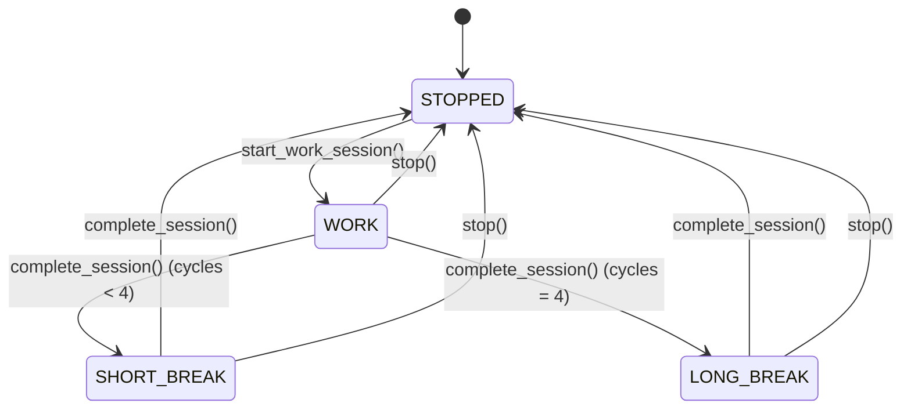

# Arquitetura do Pomodoro Timer

## Diagrama de Arquitetura (Mermaid)

```mermaid
graph TB
    subgraph "Pomodoro Timer Application"
        A[PomodoroTimer] --> B[PomodoroState]
        A --> C[State Management]
        A --> D[Timer Logic]
        A --> E[Callback System]
        
        B --> F[WORK]
        B --> G[SHORT_BREAK]
        B --> H[LONG_BREAK]
        B --> I[STOPPED]
        
        C --> J[Cycle Counter]
        C --> K[Time Remaining]
        
        D --> L[tick()]
        D --> M[complete_session()]
        
        E --> N[on_state_change]
    end
    
    subgraph "External Interface"
        O[User Interface] --> A
        A --> P[Status Updates]
        P --> O
    end
    
    subgraph "Testing Layer"
        Q[Unit Tests] --> A
        R[Integration Tests] --> A
        S[E2E Tests] --> A
    end
```

## Componentes da Arquitetura

### 1. PomodoroTimer (Core)
- **Responsabilidade**: Gerenciar o estado e lógica do timer
- **Métodos principais**:
  - `start_work_session()`: Inicia sessão de trabalho
  - `start_break()`: Inicia pausa (curta ou longa)
  - `tick()`: Decrementa tempo e gerencia transições
  - `stop()`: Para o timer
  - `get_status()`: Retorna estado atual

### 2. PomodoroState (Enum)
- **Responsabilidade**: Definir estados possíveis do timer
- **Estados**: WORK, SHORT_BREAK, LONG_BREAK, STOPPED

### 3. Callback System
- **Responsabilidade**: Notificar mudanças de estado
- **Interface**: `on_state_change(state, time_remaining)`

## Fluxo de Estados



## Estratégia de Testes

### Testes Unitários
- Estado inicial
- Transições de estado individuais
- Métodos isolados

### Testes de Integração
- Ciclo completo trabalho → pausa
- Sistema de callbacks
- Lógica de pausa longa

### Testes E2E
- Fluxo completo do usuário
- Múltiplos ciclos Pomodoro
- Cenários reais de uso