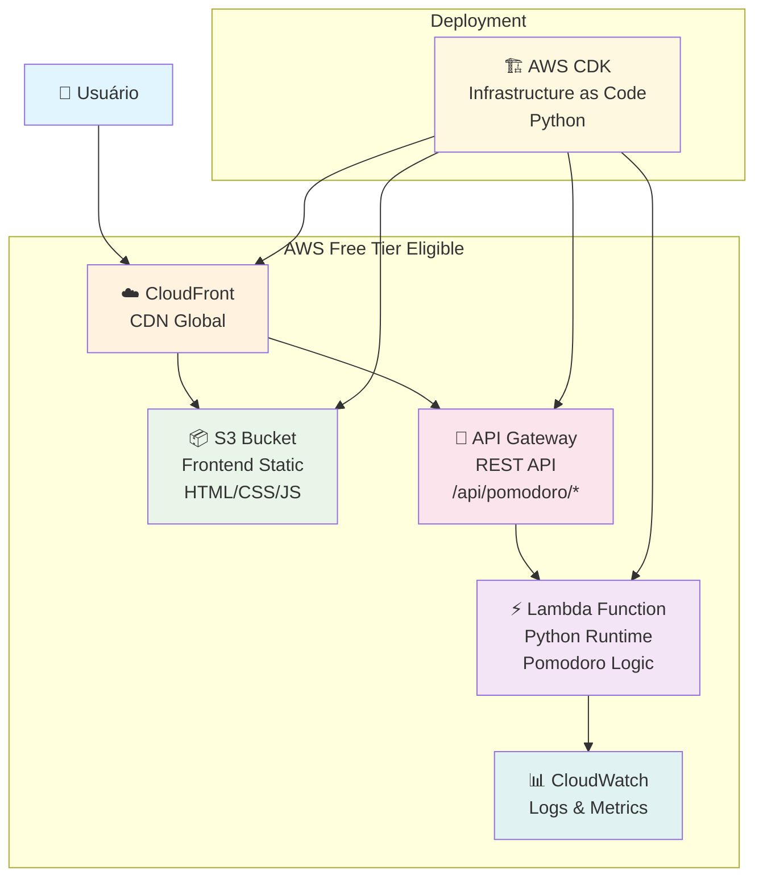

# Arquitetura AWS - Pomodoro Timer

## Componentes da Arquitetura

### Frontend (Static Web Hosting)
- **Amazon S3**: Hospedagem dos arquivos estáticos (HTML, CSS, JS)
- **CloudFront**: CDN para distribuição global e cache

### Backend (Serverless)
- **API Gateway**: Endpoint REST para comunicação com frontend
- **AWS Lambda**: Execução da lógica do Pomodoro Timer em Python

### Observabilidade
- **CloudWatch**: Logs e métricas de performance

### Deployment
- **AWS CDK**: Infraestrutura como código em Python

## Fluxo de Dados

1. **Usuário** acessa a aplicação web
2. **CloudFront** serve o frontend do S3 com cache global
3. **Frontend** faz chamadas AJAX para API Gateway
4. **API Gateway** roteia requests para Lambda
5. **Lambda** executa lógica do Pomodoro e retorna resposta
6. **CloudWatch** coleta logs e métricas automaticamente

## Benefícios da Arquitetura

- ✅ **Serverless**: Sem gerenciamento de servidores
- ✅ **Escalável**: Auto-scaling automático
- ✅ **Global**: CDN para baixa latência mundial
- ✅ **Custo-efetivo**: Pay-per-use, Free Tier elegível
- ✅ **Observável**: Logs e métricas integrados
